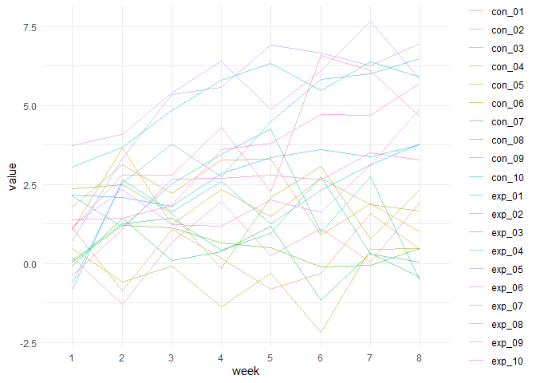
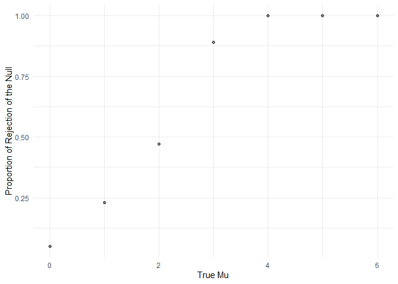
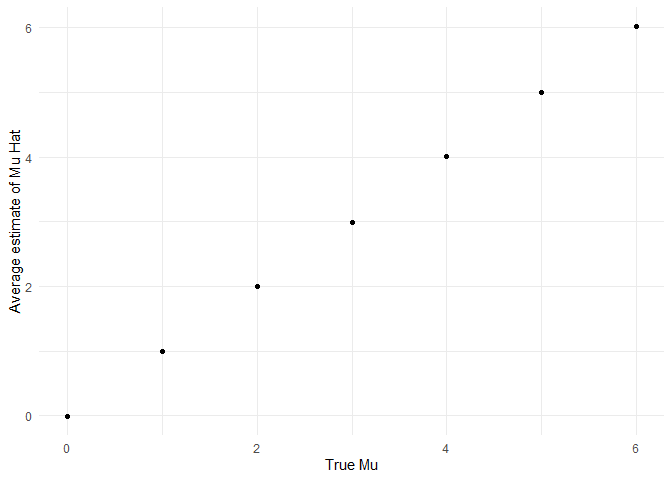
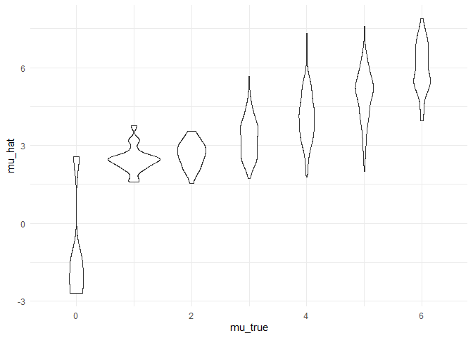

Homework 3 solutions
================
Zichen Shu

## Problem 1

Read in the data.

``` r
homicide_df = 
  read_csv("data/homicide-data.csv") %>% 
  mutate(
    city_state = str_c(city, state, sep = "_"),
    resolved = case_when(
      disposition == "Closed without arrest" ~ "unsolved",
      disposition == "Open/No arrest" ~ "unsolved",
      disposition == "Closed by arrest" ~ "solved"
    )
  ) %>% 
  select(city_state, resolved) %>% 
  filter(city_state != "Tulsa_AL")
```

Look at this a bit

``` r
aggregate_df = 
  homicide_df %>% 
  group_by(city_state) %>% 
  summarize(
    hom_total = n(),
    hom_unsolved = sum(resolved == "unsolved")
  )
```

Can I do a prop test for a single city?

``` r
prop.test(
  aggregate_df %>% filter(city_state == "Baltimore_MD") %>% pull(hom_unsolved), 
  aggregate_df %>% filter(city_state == "Baltimore_MD") %>% pull(hom_total))  %>% 
    broom::tidy()
```

    ## # A tibble: 1 x 8
    ##   estimate statistic  p.value parameter conf.low conf.high method    alternative
    ##      <dbl>     <dbl>    <dbl>     <int>    <dbl>     <dbl> <chr>     <chr>      
    ## 1    0.646      239. 6.46e-54         1    0.628     0.663 1-sample~ two.sided

Try to iterate ……

``` r
results_df = aggregate_df %>% 
  mutate(
    prop_tests = map2(.x = hom_unsolved, .y = hom_total, ~ prop.test(x = .x, n = .y)),
    tidy_tests = map(.x = prop_tests, ~broom::tidy(.x))
  ) %>% 
  select(-prop_tests) %>% 
  unnest(tidy_tests) %>% 
  select(city_state, estimate, conf.low, conf.high)
```

## Problem 2

``` r
path_df = 
  tibble(path = list.files("lda_data"),) %>% 
  mutate(path = str_c("lda_data/", path),
         map_df(path, read_csv)
    ) %>% 
  separate(path, into = c("lda", "subject_id"), sep = "/") %>% 
  separate(subject_id, into = c("subject_id", "csv"), sep = "\\.") %>% 
  select(-lda, -csv) %>% 
  pivot_longer(week_1:week_8, 
               names_to = "week",
               values_to = "value") %>% 
  mutate(week = str_replace(week, "week_", ""))
```

``` r
path_df %>% 
  group_by(subject_id) %>% 
  summarize(
    mean = mean(value)
  ) %>% 
  knitr::kable()
```

| subject\_id |      mean |
| :---------- | --------: |
| con\_01     |   0.60250 |
| con\_02     |   0.29625 |
| con\_03     |   2.18125 |
| con\_04     |   1.99375 |
| con\_05     | \-0.39125 |
| con\_06     |   1.82250 |
| con\_07     |   0.47125 |
| con\_08     |   0.21250 |
| con\_09     |   0.90000 |
| con\_10     |   2.08500 |
| exp\_01     |   5.18000 |
| exp\_02     |   2.05750 |
| exp\_03     |   2.87125 |
| exp\_04     |   3.90375 |
| exp\_05     |   5.21125 |
| exp\_06     |   5.50875 |
| exp\_07     |   2.19625 |
| exp\_08     |   3.39250 |
| exp\_09     |   2.28250 |
| exp\_10     |   3.81750 |

``` r
path_df %>% 
  ggplot(aes(x = week, y = value, group = subject_id, color = subject_id))+
  geom_line(alpha = 0.5)+
  theme(legend.position = "right")
```

<!-- -->

As we can see from the graph and table, the value of the subjects in the
control group is lower than the value of the subjects in the
experimental group.

## Problem 3

``` r
set.seed(3)

sim_t_test = function(samp_size = 30, mu = 0, sigma = 5) {
  
  sim_data = 
    tibble(
      x = rnorm(n = samp_size, mean = mu, sd = sigma)
    )
  
  sim_data = t.test(sim_data) %>%
    broom::tidy() %>%
    mutate(mu_hat = estimate) %>% 
    select(mu_hat, p.value)
  
  sim_data
}


sim_results = 
  tibble(
    mu_true = c(0, 1, 2, 3, 4, 5, 6)
  ) %>%
  mutate(
    output_lists = map(.x = mu_true, ~ rerun(5000, sim_t_test(mu = .x))),
    estimate_df = map(output_lists, bind_rows)
  ) %>% 
  select(-output_lists) %>% 
  unnest(estimate_df)
```

### Part One

plot of the proportion of times the null was rejected vs. true mu

``` r
sim_results %>% 
  group_by(mu_true) %>% 
  summarize(
    n_sample = n(),
    n_rejected = sum(p.value < 0.05)
  ) %>% 
  mutate(rejected_prop = n_rejected/n_sample) %>% 
  ggplot(aes(x = mu_true, y = rejected_prop))+
  geom_point(alpha = 0.5) +
  labs(
    x = "True Mu",
    y = "Proportion of Rejection of the Null"
  )
```

<!-- -->

When the true mu increases from 0 to 6, the proportion of times when
null is rejected increases. This makes sense since the true mu increases
while the null hypothesis is mu = 0.

### Part Two

``` r
sim_results %>% 
  group_by(mu_true) %>% 
  summarize(mu_hat_mean = mean(mu_hat)) %>% 
  ggplot(aes(x = mu_true, y = mu_hat_mean))+
  geom_point() +
  labs(
    x = "True Mu",
    y = "Average estimate of Mu Hat"
  )
```

<!-- -->

``` r
sim_results %>% 
  filter(p.value < 0.05) %>% 
  group_by(mu_true) %>% 
  summarize(mu_hat_mean = mean(mu_hat)) %>% 
  ggplot(aes(x = mu_true, y = mu_hat_mean))+
  geom_point() +
  labs(
    x = "True Mu",
    y = "Average estimate of Mu Hat for Which the Null is Rejected"
  )
```

<!-- -->

``` r
sim_results %>% 
  filter(p.value < 0.05) %>%
  group_by(mu_true) %>% 
  summarize(mean_mu_hat = mean(mu_hat)) %>% 
  knitr::kable()
```

| mu\_true | mean\_mu\_hat |
| -------: | ------------: |
|        0 |     0.0045591 |
|        1 |     2.2327189 |
|        2 |     2.6242015 |
|        3 |     3.1887061 |
|        4 |     4.0475672 |
|        5 |     4.9960517 |
|        6 |     6.0178487 |

When true mu is from 0-2, the average estimate of mu hat only in samples
for which the null was rejected is greater than the true mu. This is
because 0, 1, 2 are relatively closer to 0, there is going to be a
greater proportion of the time when null is not rejected which has value
close to 0. So when accounting for the average estimate of mu hat only
in samples for which the null was rejected, the mean will be skewed
positively.

When true mu is from 4-6, the average estimate of mu hat only in samples
for which the null was rejected is approximately equal to the true mu.
This makes sense since they are further away from the null. So it is
unlikely not to be rejected.
