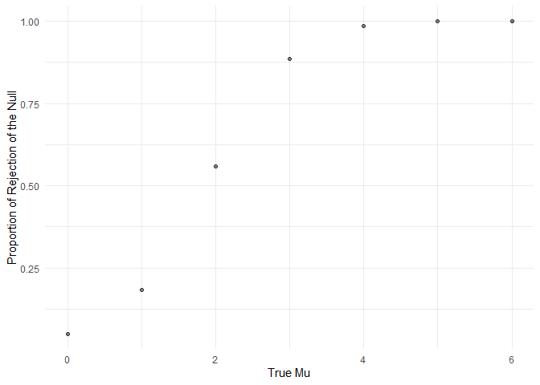
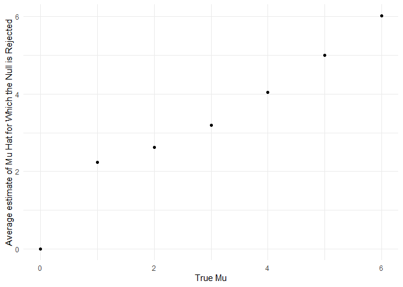

Homework 3 solutions
================
Zichen Shu

## Problem 1

Read in the data.

``` r
homicide_df = 
  read_csv("data/homicide-data.csv") %>% 
  mutate(
    city_state = str_c(city, state, sep = "_"),
    resolved = case_when(
      disposition == "Closed without arrest" ~ "unsolved",
      disposition == "Open/No arrest" ~ "unsolved",
      disposition == "Closed by arrest" ~ "solved"
    )
  ) %>% 
  select(city_state, resolved) %>% 
  filter(city_state != "Tulsa_AL")
```

Look at this a bit

``` r
aggregate_df = 
  homicide_df %>% 
  group_by(city_state) %>% 
  summarize(
    hom_total = n(),
    hom_unsolved = sum(resolved == "unsolved")
  )
```

Can I do a prop test for a single city?

``` r
prop.test(
  aggregate_df %>% filter(city_state == "Baltimore_MD") %>% pull(hom_unsolved), 
  aggregate_df %>% filter(city_state == "Baltimore_MD") %>% pull(hom_total))  %>% 
    broom::tidy()
```

    ## # A tibble: 1 x 8
    ##   estimate statistic  p.value parameter conf.low conf.high method    alternative
    ##      <dbl>     <dbl>    <dbl>     <int>    <dbl>     <dbl> <chr>     <chr>      
    ## 1    0.646      239. 6.46e-54         1    0.628     0.663 1-sample~ two.sided

Try to iterate ……

``` r
results_df = aggregate_df %>% 
  mutate(
    prop_tests = map2(.x = hom_unsolved, .y = hom_total, ~ prop.test(x = .x, n = .y)),
    tidy_tests = map(.x = prop_tests, ~broom::tidy(.x))
  ) %>% 
  select(-prop_tests) %>% 
  unnest(tidy_tests) %>% 
  select(city_state, estimate, conf.low, conf.high)
```

## Problem 2

``` r
path_df = 
  tibble(path = list.files("lda_data"),) %>% 
  mutate(path = str_c("lda_data/", path),
         map_df(path, read_csv)
    ) %>% 
  separate(path, into = c("lda", "subject_id"), sep = "/") %>% 
  separate(subject_id, into = c("subject_id", "csv"), sep = "\\.") %>% 
  select(-lda, -csv) %>% 
  pivot_longer(week_1:week_8, 
               names_to = "week",
               values_to = "value")
```

``` r
path_df %>% 
  group_by(subject_id) %>% 
  summarize(
    mean = mean(value)
  ) %>% 
  knitr::kable()
```

    ## `summarise()` ungrouping output (override with `.groups` argument)

| subject\_id |      mean |
| :---------- | --------: |
| con\_01     |   0.60250 |
| con\_02     |   0.29625 |
| con\_03     |   2.18125 |
| con\_04     |   1.99375 |
| con\_05     | \-0.39125 |
| con\_06     |   1.82250 |
| con\_07     |   0.47125 |
| con\_08     |   0.21250 |
| con\_09     |   0.90000 |
| con\_10     |   2.08500 |
| exp\_01     |   5.18000 |
| exp\_02     |   2.05750 |
| exp\_03     |   2.87125 |
| exp\_04     |   3.90375 |
| exp\_05     |   5.21125 |
| exp\_06     |   5.50875 |
| exp\_07     |   2.19625 |
| exp\_08     |   3.39250 |
| exp\_09     |   2.28250 |
| exp\_10     |   3.81750 |

``` r
path_df %>% 
  ggplot(aes(x = week, y = value, group = subject_id, color = subject_id))+
  geom_line(alpha = 0.5)+
  theme(legend.position = "right")
```

<!-- -->

## Problem 3

``` r
sim_t_test = function(samp_size = 30, mu = 0, sigma = 5) {
  
  sim_data = 
    tibble(
      x = rnorm(n = samp_size, mean = mu, sd = sigma)
    )
  
  sim_data = t.test(sim_data) %>%
    broom::tidy() %>%
    mutate(mu_hat = estimate) %>% 
    select(mu_hat, p.value)
  
  sim_data
}


sim_results = 
  tibble(
    mu_true = c(0, 1, 2, 3, 4, 5, 6)
  ) %>%
  mutate(
    output_lists = map(.x = mu_true, ~ rerun(100, sim_t_test(mu = .x))),
    estimate_df = map(output_lists, bind_rows)
  ) %>% 
  select(-output_lists) %>% 
  unnest(estimate_df)
```

``` r
sim_results %>% 
  group_by(mu_true) %>% 
  summarize(
    n_sample = n(),
    n_rejected = sum(p.value < 0.05)
  ) %>% 
  mutate(rejected_prop = n_rejected/n_sample) %>% 
  ggplot(aes(x = mu_true, y = rejected_prop))+
  geom_point(alpha = 0.5) +
  labs(
    x = "True Mu",
    y = "Proportion of Rejection of the Null"
  )
```

    ## `summarise()` ungrouping output (override with `.groups` argument)

<!-- -->

``` r
sim_results %>% 
  ggplot(aes(x = mu_true, y = mu_hat, group = mu_true))+
  geom_violin()
```

<!-- -->

``` r
sim_results %>% 
  filter(p.value < 0.05) %>% 
  ggplot(aes(x = mu_true, y = mu_hat, group = mu_true))+
  geom_violin()
```

<!-- -->

``` r
sim_results %>% 
  filter(p.value < 0.05) %>%
  group_by(mu_true) %>% 
  summarize(mean_mu_hat = mean(mu_hat))
```

    ## `summarise()` ungrouping output (override with `.groups` argument)

    ## # A tibble: 7 x 2
    ##   mu_true mean_mu_hat
    ##     <dbl>       <dbl>
    ## 1       0       -1.16
    ## 2       1        2.46
    ## 3       2        2.65
    ## 4       3        3.28
    ## 5       4        4.08
    ## 6       5        4.93
    ## 7       6        6.00
